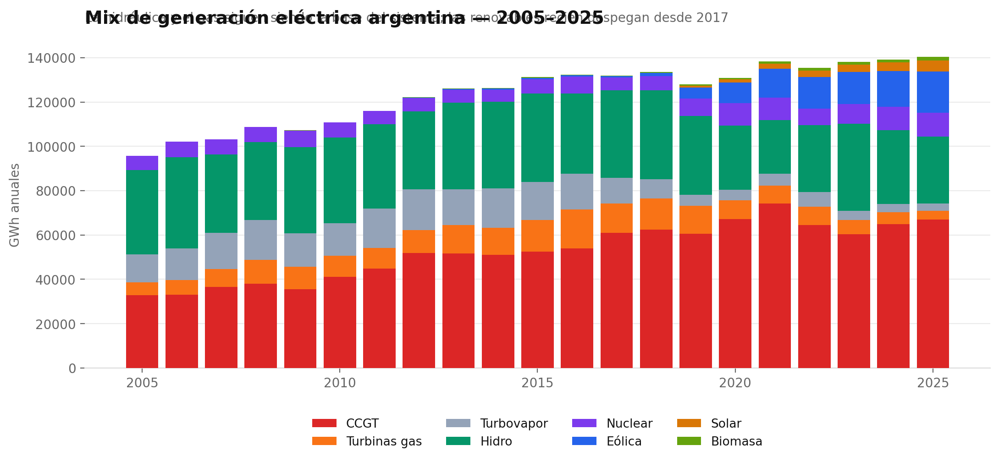
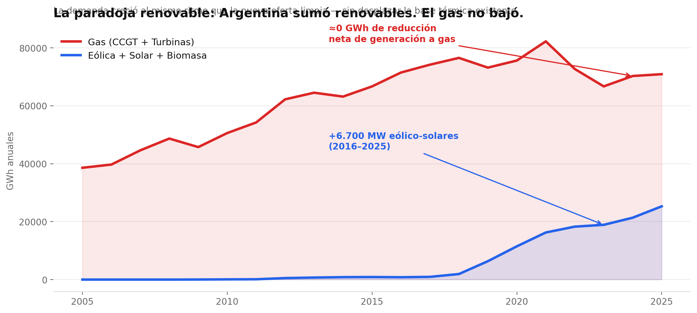
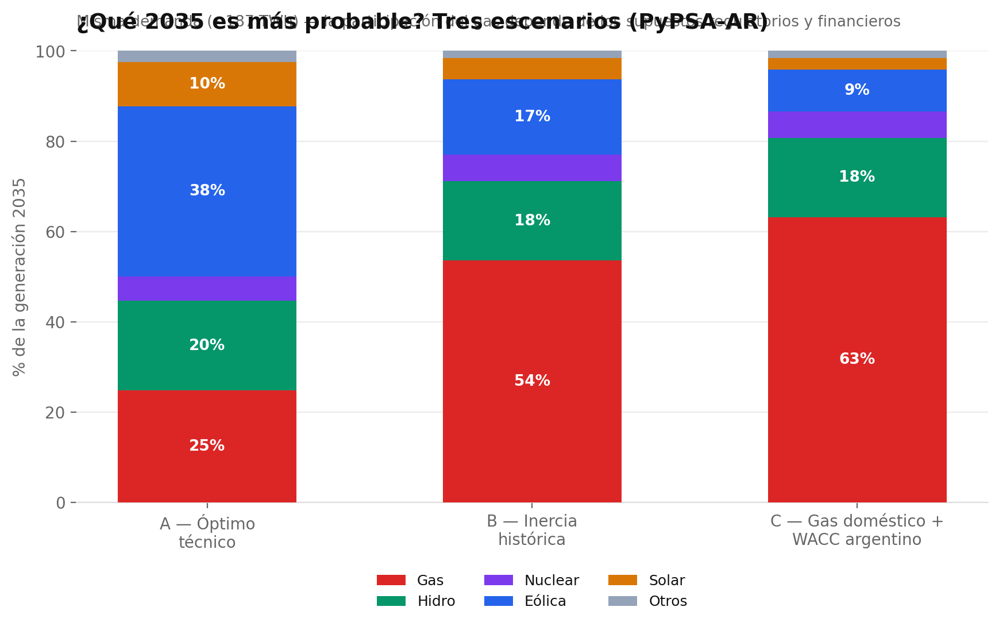
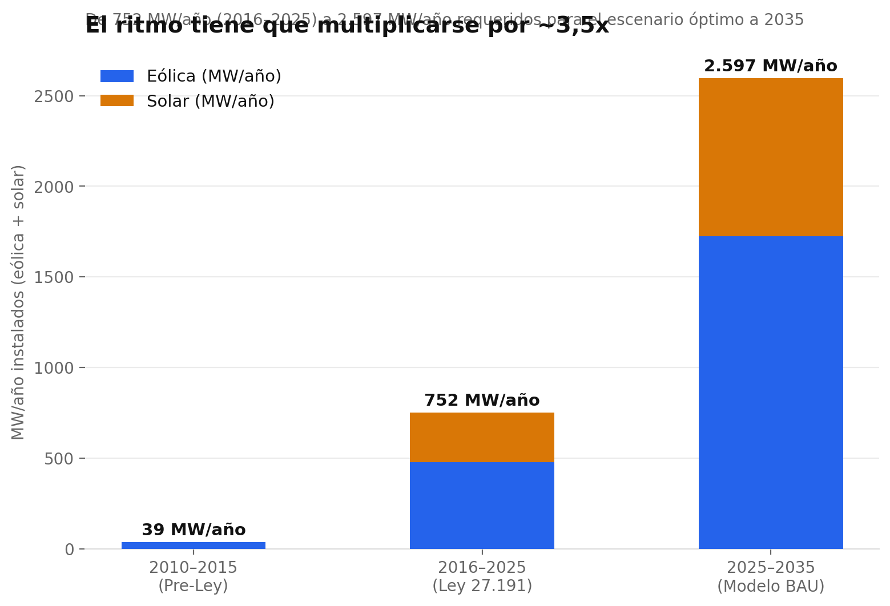

# Sistema Eléctrico Argentino 2035 — Análisis con PyPSA-AR

**Análisis de la brecha entre la generación eléctrica real de Argentina (2005–2025) y la
trayectoria de mínimo costo que proyecta PyPSA-AR hacia 2035**, con foco en la paradoja del
crecimiento renovable sin desplazamiento térmico, la magnitud de la nueva capacidad necesaria
y el rol de la transmisión como cuello de botella.

> 🇬🇧 **English summary:** This repo analyzes 20 years of official Argentine electricity
> generation data (CAMMESA, 2005–2025) alongside the outputs of [PyPSA-AR](https://github.com/FTDT-PyPSA/PyPSA-AR),
> the first open-source least-cost optimization model of Argentina's high-voltage grid
> (Fundación Torcuato Di Tella). It documents why 6,700 MW of new wind and solar (2016–2025)
> failed to displace a single GWh of gas generation, and what the model's 2035 Business-As-Usual
> scenario implies: 187 TWh of demand, a 68% optimal renewable share, ~26,000 MW of new wind/solar
> capacity, and transmission — not capital — as the binding constraint.

## Por qué importa

Entre 2016 y 2025, Argentina incorporó más de 6.700 MW de potencia eólica y solar — el mayor
ciclo inversor de su historia energética — y sin embargo la generación térmica a gas se mantuvo
prácticamente sin variación (~71.500 GWh en 2016 vs. ~70.900 GWh en 2025). Las renovables
cubrieron el crecimiento incremental de la demanda, pero no desplazaron la base térmica
existente. Este trabajo cruza esa evidencia histórica con los resultados del modelo PyPSA-AR
para dimensionar qué se necesitaría para revertir esa dinámica de acá a 2035.

*Los gráficos de este README son versiones estáticas. El [informe completo](informe/sistema-electrico-argentino-2035.html)
incluye las mismas visualizaciones en versión interactiva (Plotly, con tooltips) más las secciones
sobre transmisión, calibración del gas y viabilidad comercial.*

## Hallazgos clave

| | 2025 (real, CAMMESA) | 2035 (óptimo, PyPSA-AR BAU) |
|---|---|---|
| Demanda anual | 147 TWh | 187 TWh |
| Cobertura renovable | 18,9% | 68% |
| Participación del gas natural | 51% | — |
| Intensidad de CO₂ del sistema | 0,235 tCO₂/MWh | 0,073 tCO₂/MWh (−69%) |
| Nueva capacidad eólica + solar requerida | — | ~26.000 MW |

- **La paradoja renovable:** +6.700 MW eólico-solares (2016–2025) → ≈0 GWh de reducción neta de
  generación a gas, porque la demanda creció ~38 TWh en el mismo período y absorbió toda la
  nueva oferta limpia.
- **El cuello de botella es la transmisión, no el capital:** el recurso eólico de excelencia está
  en Patagonia (factor de capacidad promedio 44,5%) y el solar en NOA/Cuyo, a 1.000–2.000 km de
  los centros de demanda (AMBA, Litoral). Sin refuerzo de las líneas de 500 kV en los corredores
  Patagonia→AMBA y NOA→Centro, la energía generada no llega a donde se consume.
- **Condiciones de contorno regulatorias:** el modelo asume un WACC internacional bajo (4–5%);
  la prima de riesgo país argentina eleva el costo de capital real y resta competitividad a las
  renovables (CAPEX-intensivas) frente al parque térmico ya amortizado.

<p align="center">
  
</p>

<p align="center">
  
</p>

## Tres escenarios posibles hacia 2035

El modelo permite contrastar el óptimo técnico contra caminos condicionados por la economía y la
regulación argentina. Misma demanda proyectada (~187 TWh) — la composición de la matriz cambia
radicalmente según los supuestos:

- **A — Óptimo técnico (BAU puro):** el mínimo costo bajo un WACC internacional normalizado
  (4–5%). Gas al 25%, renovables al 47% (eólica + solar).
- **B — Inercia histórica:** si Argentina sostiene el ritmo post-Ley 27.191 (~479 MW eólicos/año,
  ~273 MW solares/año) sin acelerar ni frenar. Llega a 2035 con ~40% de cobertura renovable — muy
  por debajo del óptimo — y una brecha de ~100 TWh que en la práctica se cierra con gas.
- **C — Gas doméstico + WACC argentino:** con la prima de riesgo país real encareciendo el capital
  de las renovables y el gas de Vaca Muerta compitiendo a precio doméstico subsidiado, el gas
  vuelve a ser la opción dominante (63% de la matriz).

<p align="center">
  
</p>

<p align="center">
  
</p>

## Qué hay en este repositorio

```
notebooks/
  PyPSA_AR_Analisis.ipynb      # Notebook de Google Colab: carga los resultados del
                                # modelo, construye las visualizaciones (mix 2024 vs
                                # BAU 2035, balance regional, capacidad nueva, congestión
                                # de líneas, sensibilidad WACC/costo de gas) y exporta
                                # el informe HTML consolidado.
informe/
  sistema-electrico-argentino-2035.html   # Informe final, standalone, con gráficos
                                           # interactivos (Plotly) embebidos.
assets/
  hero.png, mix_generacion_2005_2025.png,
  paradoja_gas_renovables.png, escenarios_2035.png,
  ritmo_construccion.png       # Versiones estáticas de los gráficos, para este README.
requirements.txt
```

## Fuentes de datos y atribución del modelo

Este repositorio **no reimplementa ni reentrena** un modelo de sistema eléctrico. Es una capa de
análisis y visualización construida sobre:

- **[PyPSA-AR](https://github.com/FTDT-PyPSA/PyPSA-AR)** — modelo de optimización de mínimo
  costo (DC Optimal Power Flow, solver HiGHS) de la red de 500 kV del SADI, desarrollado por
  Gustavo Barbaran, Juan Manuel Bregman y Gustavo Ariel Ramirez, y mantenido por la
  **Fundación Torcuato Di Tella (FTDT)**. El modelo cubre 95 barras, 103 líneas activas y ~91%
  de la capacidad instalada del SADI (39.873 de ~44.000 MW), calibrado contra el despacho real
  de la semana del 1–7 de febrero de 2024 (captura el 96,7% de la generación real CAMMESA). La
  resolución espacial usada en este análisis es k=10 clusters.
- **CAMMESA** — series históricas de generación por tecnología (2005–2025), informes de
  combustibles (CVP) e informes anuales, como fuente de los datos reales usados para contrastar
  contra las proyecciones del modelo.

El notebook clona el repositorio `FTDT-PyPSA/PyPSA-AR` para obtener los CSV de resultados
(`summary_global.csv`, `summary_by_carrier.csv`, `summary_by_cluster.csv`, `summary_by_line.csv`,
`new_capacity.csv`) del escenario `results_2035_BAU_k10`. **Ese repositorio no publica una
licencia explícita**, por lo que sus datos y resultados no se redistribuyen dentro de este
repo — se obtienen en tiempo de ejecución directamente desde la fuente. Cualquier uso de esos
datos más allá del análisis/comentario aquí presentado debe consultarse con FTDT-PyPSA.

⚠️ **Nota metodológica del propio informe:** en su versión actual (k=10), PyPSA-AR no valida
la distribución geográfica fina de los recursos eólico/solar — asigna capacidad nueva donde la
red es conveniente, no necesariamente donde el recurso físico es óptimo. Esto no invalida la
conclusión sobre transmisión como restricción binding, pero exige leer los resultados
por región con cautela.

## Cómo reproducir el análisis

**Opción A — Google Colab (recomendado, es como fue construido):**

1. Abrí `notebooks/PyPSA_AR_Analisis.ipynb` en [Google Colab](https://colab.research.google.com/).
2. Ejecutá la Sección 0 (monta tu Google Drive, instala `plotly`, `kaleido`, `openpyxl`, y clona
   `FTDT-PyPSA/PyPSA-AR` para copiar los CSV de resultados a tu Drive la primera vez).
3. Ejecutá el resto de las secciones en orden. Las corridas siguientes son instantáneas porque
   los datos ya están cacheados en Drive.

**Opción B — Localmente / Jupyter:**

1. `git clone https://github.com/<tu-usuario>/pypsa-ar-sistema-electrico-2035.git`
2. `pip install -r requirements.txt`
3. Reemplazá el bloque de montaje de Drive (Sección 0.1) y `BASE_DIR` por una carpeta local, por
   ejemplo `BASE_DIR = './data'`.
4. Clonar `FTDT-PyPSA/PyPSA-AR` manualmente y copiar los CSV de `networks/scenarios/results_2035_BAU_k10/`
   a `./data/results/` (mismos archivos que lista la Sección 0.3 del notebook).
5. Corré el notebook con Jupyter Lab/Notebook.

## Stack técnico

Python · pandas · Plotly · PyPSA-AR (Fundación Torcuato Di Tella) · Google Colab · datos CAMMESA

## Autor

**Mariano Romero** — Licenciado en Ciencia Política y Relaciones Internacionales (UCALP),
Maestrando en Energía (CEARE/UBA). Análisis publicado originalmente en mayo de 2026.

[LinkedIn](https://www.linkedin.com/in/marianoromero23) · [GitHub](https://github.com/romeromariano03)

## Licencia

El código del notebook y el diseño/redacción del informe HTML de este repositorio se publican
bajo licencia MIT (ver `LICENSE`). Los datos y resultados del modelo PyPSA-AR pertenecen a sus
autores originales (FTDT-PyPSA) — ver la nota de atribución más arriba.
